# Geoinformatics

===
Source: Dr.-Ing. Volker Walter, Lecture Geoinformatics  
<https://www.ifp.uni-stuttgart.de/en/teaching/geoengine/geoinformatics/>  
Outline: Zhouyan Qiu, msqiuzy@outlook.com

## Introduction

### geographical information system(GIS) - IMAP of spatial data/geodata  

computer-based systems for the acquisition and update,  storage and query, analyses and simulation as well as output and presentation of spatial data 

* acquisition and update - input
* storage and query - management
* analyses and simulation - analyses
* output and presentation - presentation

### geodata: data elements which are referenced to a part of the earth

* satellite data
* aerial data
* topographic maps
* street network data - navigation systems
* thematic maps - represent information
* cadastre data
* 3D city models

### GeoTIFF: special form of tiff  

contain information about the **georeferencing** of the image and other infomation, e.g., map projection

### GIS-Environments LNSED

* Land Information Systems(LIS): systems which are developed and operated by state surveying institutes
* Network Information Systems(NIS): Facility management of networks (for example from energy, water and gas supply companies)
* Space Information Systems(SIS): systems for the decision support for planning and development
* Environmental Information Systems(EIS)
* Domain Information Systems(DIS): systems which have special applications

### What can I do with a GIS: planning, presentation, navigation, simulation, management of geodata

## Data Acquisition

### Primary data acquisition: acquisition **directly** from the object or from an image from it

* Geodesy: measurement with theodolite, total station, gps-receiver,...
* Photogrammetry: Reconstruction of objects regarding their form and position from photographic images
  * Aerial film camera with FMC(Foward motion compensation)
    * Film format 230 x 230 mm
    * Imaging at 60-90% overlap along strip, 10-30% across strip
    * example: v = 70 m/s = 250km/h, m=1:13.000, T = 1/1000 s, FMC = 70m/s * 1/1000s / 13.000 = 0.05mm
  * Film based camera and scanner  
    aerial image scanner Zeiss - SCAI : accuracy 2 μm  
  * Digital Sensor - DPA(Digital Photogrammetric Assembly)
    * pixel size 10 μm
    * resolution 8 bit
    * spectral range: blue 440-525nm, green 520-600nm, red 610-685nm, nir 770-890nm.
    * Advantages and disadvantages of digital sensors in comparison with analogue sensors
      * Advantages 3
        * higher radiometric resolution (11 or 12 bit instead of 8 bit)
        * digital process chain
        * multispectral bands
      * Disadvantages: Images have high data volume - time expensive
* Remote sensing: classification
  * Digital image acquisition with satellite systems
    * Landsat - Landsat 7 has eight bands which may be combined in various ways by assigning one band to each of the three visible channels: red, green and blue, to create a false colour image.
    * SPOT
    * IRS-1C and 1D (Indian Remote Sensing Satellite)
    * IKONOS
    * QuickBird
  * Advantages of satellite data
    * capture large areas with high repetition rate
    * no physical or administrative barricades
    * cost effective for large geographic areas and repetitive interpretations
    * multispectral images
  * Disadvantages of satellite data
    * only by low degree of cloudiness
    * not so flexible as airborne systems
    * low resolution and accuracy as by airborne systems
* Georelated and other disciplines: specific sensors, field inspections,...

### Secondary data acquisition: acquisition of already interpreted data - Map digitizing

* manual: digitizier tablets, on-screen digitizing
  * advantage
    * low hardware costs
    * high accuracy(0.075-0.25mm)
    * direct checks and error handling
    * flexibility
  * disadvantage: time intensive
  * on-screen-digitizing
    * using image processing operations, objects in the images can be enhances - support measurement
    * already measured objects can be suppressed
    * acquisition accuracy
      * Digitizing accuracy varies from 0.075 mm to 0.25 mm -> = 0.20 mm (assumption)
      * the acquisition accuracy is calculated by: = digitizing accuracy × scale
      * digititing of 1:10.000 map: 0.2mm*10.000 = 2m
  * Transformation between systems necessary in order to directly measure world coordinates at the digitizer
* semi-automatic: operator supported measurement on scanned maps
  * Prerequisite: scanned images, manual object identification, automatic measurement
  * advantages
    * automatic tracking of objects(lines, areas, symbols, text)
    * operator only has to work in case of errors
  * disadvantages: presume high quality data
* automatic: fully automatic process, pattern recognition and image understanding
  * raster-vector transformation
  * pattern recognition: numbers, letters, graphical objects, symbols
  * later checks and interactive error removal
  * special software for specific map types

### Geo basis data

* Geo-basis data in Germany: ATKIS – Amtliches Topographisch Kartographisches Informationssystem(official topographic cartographic information system)
  * DLM25: 1:25.000 (accuracy +- 3m)
  * DLM250: 1:250.000 (accuracy +- 30m)
  * DLM1000: 1:1.000.000 (accuracy +- 100m)
* Street network data
* GDF - Geographic Data File: International Standard for the acquisition and exchange of road network data
* Navigation Systems
* Volunteered Geographic Information(VGI)
  * provision of tools to create, assemble, and disseminate geographic data provided voluntarily by individuals
  * Wikimapia
  * Google My Maps
  * OpenStreetMap - a free project open to everyone to collect spatial data
    * GPS receiver - most important data source
    * images: landsat 7 images & areal images
    * local knowledge
    * import data

## Data Modeling

reality - data model(abstraction selection) - data structure(computer readable) - file structure(physical storage)

### 4 layer model of a GIS

* external view - external model - selection of objects and relations  
transition from reality to computer system involves abstraction process. thus the model only reflects certain aspects of reality
* conceptual view - geometric topologic - thematic modeling
  * describes the transformation of the objects of the external model into computer readable data structures
  $$objects<\frac{thematric}{geometry<\frac{position}{topology}}$$
  * Queries to Spatial Information System
    * give identification of the line the cursor points - geometry
    * give attributes of the area the cursor pointss - geometry+thematic
    * give all houses in the given rectangles - geometry+thematic
    * give all parcels adjacent to street - thematic
    * who is owner of house - thematic
* Metric
Definition: a distance function d: $X \times X \Rightarrow \Re_{0}^{+}$ is a metric if the following three conditions are fulfilled for all $(P, Q) \in X \times X:$  
One dimension  
$\sqrt{(q-p)^{2}}=|q-p|$  
Three dimensions  
$d(p, q)=\sqrt{\left(p_{1}-q_{1}\right)^{2}+\left(p_{2}-q_{2}\right)^{2}+\left(p_{3}-q_{3}\right)^{2}}$  
n dimensions  
$d(p, q)=\sqrt{\left(p_{1}-q_{1}\right)^{2}+\left(p_{2}-q_{2}\right)^{2}+\cdots+\left(p_{i}-q_{i}\right)^{2}+\cdots+\left(p_{n}-q_{n}\right)^{2}}$
* logical view - data relation model - caption
* internal view - how you store data

### Different types of GIS

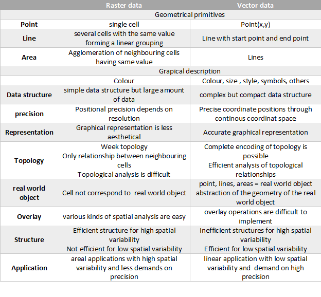

* raster GIS: store and analyses raster data
* vector GIS: store and analyses vector data
* hybrid GIS: store and analyses raster and vector data
* advantages and disadvantages of raster and vector data
  * simple strcuture - complex structure
  * large amount data - compact data structure
  * positional presition depends on resolution - precise coodinate positions through continous coordinate space
  * graphical representation is less aesthetical - accurate graohical representation
  * weak topology - complete encoding of topology
  * various kinds of spatial analysis are easy - overlay operation are difficult to implement

### 2.5D and 3D Data

* 2.5D: for every Position (x, y) exactly one z-Value (Surfaces)
* 3D: one (x, y) Position can have several z-Values (Bodies or Solids)

### Modeling of Surfaces

* Surface Reconstruction with Polynoms: only simple forms are possible
* Surface Reconstruction with Irregular Triangulated Networks (TIN)
  * TIN - triangulated irregular networks
    * network of the triangules connected together to create a 3D surface with no overlaps and no gaps
    * analysis of a surface's slope and aspect and for modelling 2.5D data.
  * The height at a position (x, y) is calculated by interpolating in the corresponding triangle - interpolatio in triangles
  * **brute force triangulation**  
  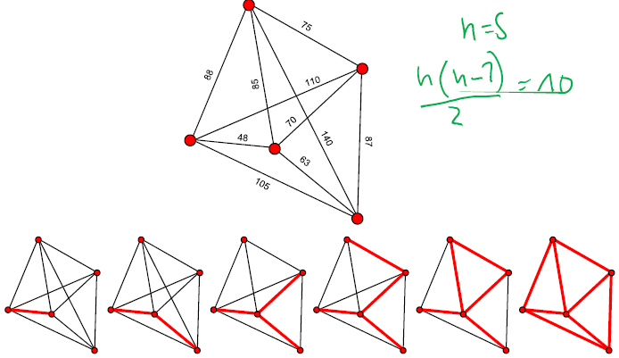  
    * triangulation
      * calculate the distance between all point pairs: n points -> n(n-1)/2 cost
      * search for minimum distance and delete all distance which larger that distance
      * calculate with 1 until no line intersections
    * pros and cons
      * easy implyment
      * good results
      * high computing time
    * Linear Interpolation in Triangles $z = f(x, y) = a_0 + a_1x + a_2y$

### geometrical data modelling - Description of the geometry of spatial objects

* Primitive Instancing  
  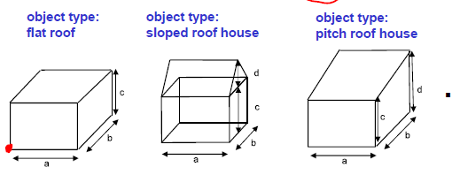  
  * define for each object type a complete List of description parameters to describe the form and the position of an object.
  * Pro: Simple model, low Data Volume
  * Contra: use only predefined Models -> it is not possible to combine Instances to create new more complex Structuress
* Spatial Occupancy Enumeration
  * A 3D Object is modeled by a List of spatial Cells occupied by the Object
  * The Cells (or Voxels) are cubes of a fixed Size and are arranged in a fixed spatial grid
  * analog to raster Modelling in 2D
  * Pro: simple structure (a list of occupied Cells).
  * Contra: Higher Model Accuracy requires higher Number of Cells
  * Popular for medical Purposes such as CAT scans
  * Octree: a Tree Data Structure in which each (internal) Node has eight Children  
      
    * The Leafs are analog to Voxels in Spatial Occupancy Enumeration
    * Octrees are the three-dimensional analog to Quadtrees
    * Pro: less Data Volume as Spatial Occupancy Enumeration
    * Contra: access to the Data is not so easy as in Spatial Occupancy Enumeration
* Cell Decomposition(LEGO)
  * an Extension of Spatial Occupancy Enumeration
  * Cells are not only Cubes but also other Primitives like Prisms, Spheres, Cylinders, Cones
  * The Cells can optionally be parameterized with Primitive Instancing  
    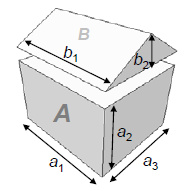  
    * Pro: better Representation of 3D Objects (no blocky Structures because of Voxels)
    * Contra: more difficult to guarantee Correctness (Cells must fit together – it is not allowed that one Cell penetrates other Cells)
* [Boundary Representation (BREP)](https://www.brainkart.com/article/Boundary-representation-method-(B-rep)-and-Constructive-Solid-Geometry-(CSG-and-C-rep)_5689/)  
  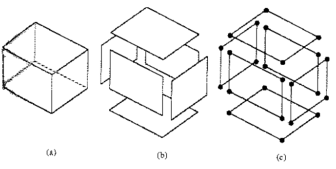  
  * 3D Objects are defined by their enclosing Surfaces - Topological Representation
  * Pro
    * very flexible
    * direct Extension of 2D Vector Data
    * it is possible to make local changes without complete new Construction
    * Topology is completely stored -> Topological Analyses are possible
  * Contra
    * Correctness is difficult to prove
    * High Data Volumes
* Constructive Solid Geometry (CSG)  
    
  * CSG uses Primitives (Prisms, Spheres, Cylinders, Cones, etc.) and Boolean Operations(Union, Subtraction, Intersection) to create 3D Objects
  * The Primitives are modeled with Primitive Instancing
  * Pro
    * Easy to construct very complex Models with few Primitives
    * less storage
    * can be converted to BREP
  * Contra
    * not unique
    * CPU intensive
* Sweep Representations  
  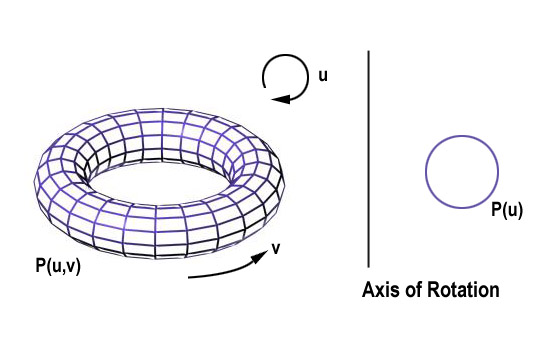  
  * construct 3D Objects that have some kind of Symmetry
  * A Sweep Representation consists of a Shape and a Trajectory
  * Sweep Representations allow the Modelling of very Complex Objects
* Freeform Shapes

### topological data modelling - Description of spatial relations of objects without considering the coordinates

* Topology
  * describes spatial relations among geometric objects
  * based on Leibniz' analysis situs
  * metric aspects are not relevant
  * graph-theory
  * spatial relations among the geometric primitives: node, edge, mesh
* The Königsberger Bridge Problem  
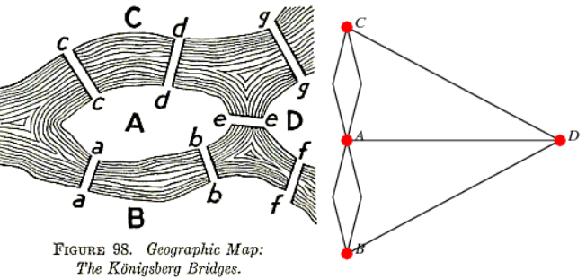  
  * Is it possible to make a walk which uses every bridge exactly one time  
  * a sequence of letters is a sequence of bridges
  * a bridge ends in that area where the next bridge starts. Therefore the letter is used twice
  * every letter NIES is represented even times - except for two letters (start and end)
* The Supply-Net-Problem: Is it possible to find a intersection-free configuration  
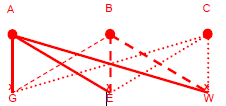  
* Travelling Salesman Problem: visit n cities and come back to the starting point in shortest time
* Center problem: k firehouses shall be build in n cities in such a way that every city is reachable as fast as possible
* Graph: A Graph G(N, E) consists of a set of Nodes N and Edges E
  * Undirected, directed, weighted, directed + weighted
  * Cyclic, only cyclic, accyclic
  * tree
  * not connected
* topological primitive: node, edge, mesh/face, body
* planaer graph: a graph if it can be drawn in 2D without intersection  
Euler equation: $C = n - e + f = 2 (2)$ test if a graph is planar  
* topological data model  
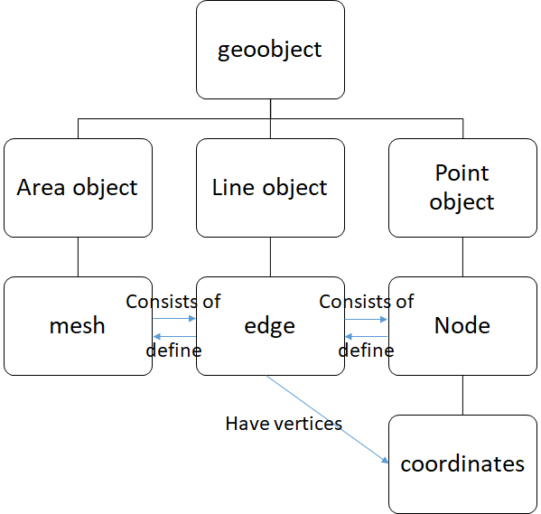  
* importance of Topology
  * description of relations between elementary objects (node, edge, area)
  * important for consistency checks  
  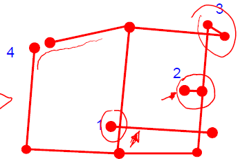  
    1. under- / overshoots
    2. dead ends
    3. weird polygons
    4. closed polygons
  * redandance free storage
* [incidence and adjacency](http://www.btechsmartclass.com/data_structures/graph-representations.html)  
  
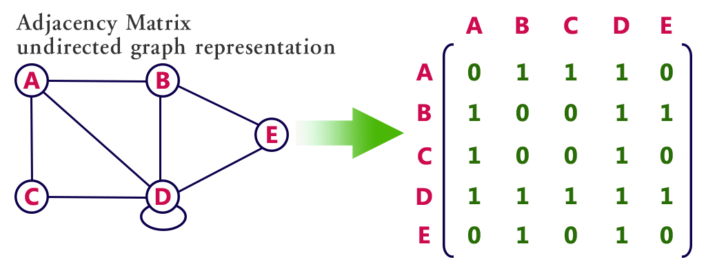  
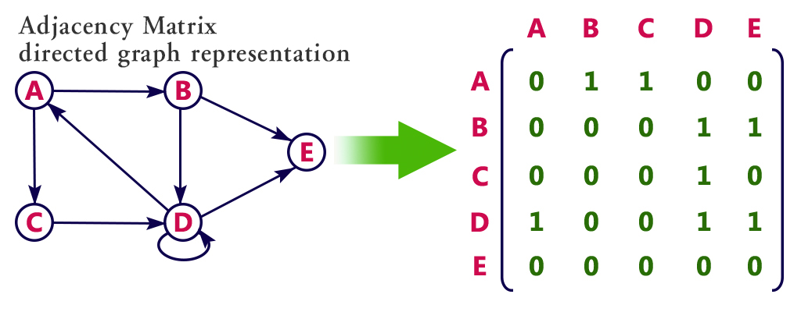  
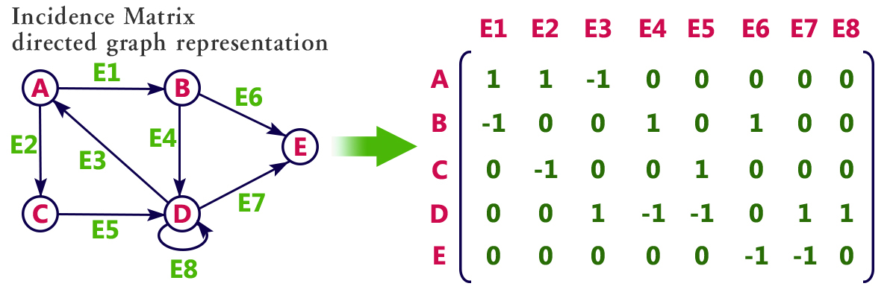  
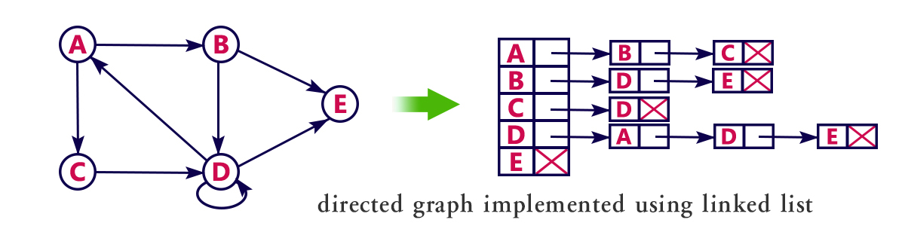  
  * Incidence names the meeting of different topologic primitives  
  Incidence matrix:  
  $B(i,j) = 1$ if edge i starts in node j  
  $B(i,j) = -1$ if edge i ends in node j  
  * Adjacency names the meeting of same topologic primitives
    * Adjacency matrix
      * Main diagonal contains number of adjacent nodes
      * Nodes adjacent to each other -1
      * symmetrical
    * The adjacency matrix A can be calculated directly from the incidence matrix: $\underline{A}=\underline{B}^{\top} \underline{B}$
* [Minimal Spanning Tree](https://aquarchitect.github.io/swift-algorithm-club/Minimum%20Spanning%20Tree/)
  * A spanning tree connects all nodes of a graph. A minimal spanning tree is that tree where the length (costs) of the spanning tree is minimal
  * A minimal spanning tree has no cycles. That means that there are no redundancies.
  * Kruskal Algorithm  
    
    * take the shortest edge and check if the two nodes of that edge are in the same set
    * if yes: this would lead to a cycle and the edge can be discarded
    * if no: merge the two sets which contain the beginning and end node of the edge
  * Prim's Algorithm  
    
  * Bubblesort  
 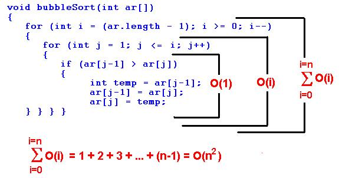  

### thematic data modeling - Description of the thematic of spatial objects

  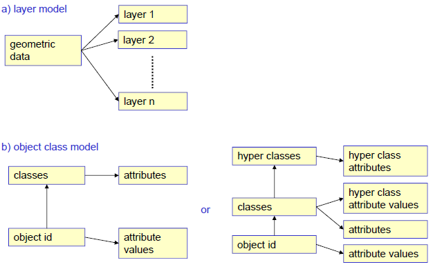  
referred to the description, handling and storage of the thematic of spatial objects  
use thematic layers and object hierarchies to combine objects with the same thematic  

* thematic data
  * refers to the data that is independent from geometry and topology relations
  * describes the attributes and sematic relations between objects
  * coded additionally in the graphic representation
  * represented by alphanumertical symbol in the database
    * geometric information are represented by points, lines and areas
    * topologic information are represented by nodes, edges and meshes
* Layer principle
  * layer principle stores geometric data with different thematic meanings in different layers
  * to produce different kinds of maps, the transparencies could be selected and combined, instead of drawing a new map each time
  * all layers must be defined in the same coordinate system!
  * each layer contains different information
  * simple model; easy superimposition
  * no hierarchy - all layers are of equal priority
  * not flexible: all layers have to be of same size
* objects class principle  
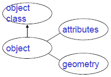  
  * the modern form of thematic modeling
  * object class principle is linked to object-oriented programming paradigm
  * Hierarchical Organization $(1:n)$
    * subclass inherit all attributes from their superclasses
    * hierarchical organization describes dependencies between objects
  * Semantic Network $(m:n)$
    * allows higher order relations(m:n) between object classes, e.g., a river can be both a subclass of waters and of traffic
* thematic modeling
  * objects can have relations(attributes) to other objects
  * different modeling language
    * ER (Entity-Relationship-Model)
      * objects - entities - rectangles
      * attributes - ellipses
      * relationships - rhombs
      * cardinality - number of involved attributes
        * 1:1 man - married - woman
        * 1:n owner - own - parcel
        * n:m students - attend - lecture
      * similar entity types can be grouped with a is-a relation representation with hexagon
        * subtypes inherit the attributes of supertypes
    * NIAM (Nijsen Information Analysis Method)
    * OMT (Object Modeling Technique)
    * UML (Unified Modeling Language)

### data structures

* vector data: spaghetti data, node and edge lists
* raster data: matrix, compression algorithms
* thematic data: tables

## Web based GIS technologies

* Internet Protocol
  * The Internet Protocol (IP) is the basic communication
  * protocol in the Internet and is used to transport data
  * packages from a sender to a recipient in the Internet
  * IPV4: 4 Bytes, 0-255, 4 blocks, separate with points, e.g., 129.45.56.345, therefore 2^32 different addresses
  * IPV6: 16 Bytes, 8 blocks of each 4 hexadecimal numbers, separate with columns, e.g., 2a01:0db8:85a3:08d3:1319:8a2e:0370:7344, therefore 2^128 different addresses
* Internet services: protocols for accessing, using or participating in the Internet that are developed on the internet protocol.
* Word wide web - hypertext system: documents are connected with hyperlinks
  * HTTP(HyperText Transfer Protocol) is the underlying protocol
  * HTML (HyperText Markup Language) is a language to compose text,
    * Document Type Declaration is an instruction that associates the document with a particular version of HTML). E.g.: HTML 4.01 Strict
    * HTML Head contains additional technical or documentary information which is not shown in the browser
    * HTML BODY contains the visible information of the document
  * images and other material into web pages
  * URLs(Uniform Resource Locater) are used for the unique identification of resources in the Internet.  protocol://host/location
    * protocol defines the network protocol followed by a colon and two slashes, e.g., $http://, ftp://$
    * host identifies the computers by its hostname (e.g. www.ifp.unistuttgart.de) or by its IP address (e.g. 127.58.140.33). Host names can be translated automatically into IP addresses with Domain Name Servers (DNS) in the Internet
    * location identifies the path of the resource on the server (e.g.:lehre/vorlesungen.html)
  * CSS – Cascading Style Sheets
    * HTML is used to structure a document in different semantic parts
    * CSS is used to define the Look and formatting of a document(colors, font types, font sizes, …)
  * publish geodata in the WWW
  * Static Maps realized with HTML images  
    Image Maps: an image with different clickable areas (as opposed to a normal image link, in which the entire area of the image links to a single destination)  
    provide an easy way of linking various parts of an image without dividing the image into separate image files  
  * Static vs. Dynamic Map Server
    * Static Map Server
      * All maps are preprocessed (static)
      * Only those maps can be visualized which are preprocessed
      * Complex queries (selection of object types or analysis functionality) or a individual map representations are not (hardly) possible
    * Dynamic Map Server
    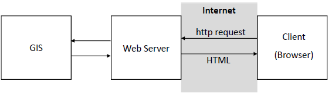  
      * The maps are created dynamically when the client makes a request
      * The Internet Web Server is connected to a GIS (3-level-Architecture)
      * The maps are images (gif, png, jpg, etc.) in HTML documents or vector data (e.g. GML Geography Markup Language)
  * Thick Server and Thin Client vs. Thin Server and Thick Client
    * Thick Server and Thin Client - Realization with server-side technologies
    * Thin Server and Thick Client - Realization with client-side technologies
* Server-side Technologies: connect a GIS with a Web Server
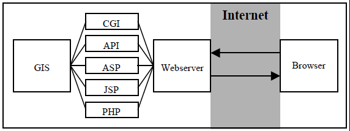  
  * CGI(Common Gateway Interface): generate dynamic content on Web pages. called with a http-request
  * Webserver API (Application Interface)
    * The function is not external processes as with CGI but are executed in the address space of the server
    * Advantage: higher execution speed
    * Disadvantage: an error in the external function can crash the Webserver
  * ASP (Active Server Pages): proprietary technology which runs only on Microsoft Webserver
  * JSP (Java Server Pages): run on Windows and Linux/Unix
  * PHP
* Client-side Technologies
  * DHTML – Dynamic HTML
    * HTML for  writing of documents
    * a client-side Script Language – usually JavaScript
    * VBScript: supported only by Microsoft Internet Explorer (with Plug-In also Mozilla)
    * Disadvantages of JavaScript and VBScript: Everyone can see the code because it is embedded in the HTML document - combinations of JavaScript and Java
  * JAVA-Applets: run interactive programs on a Webbrowser without sending or reciving data from a server
  * ActiveXControls: Microsoft Internet Explorer
  * PlugIns
    * An Applet has to be reloaded if the corresponding HTML-page is reloaded
    * A Plug-In has to be installed only one time: less network load
    * different Web Browser and different Operating Systems are not compatible and need different Plug-In versions
* SVG - Scalable Vector Graphics - XML-based data format for the exchange of 2-dimensional vector graphics
* Flash
  * Platform for the programming and visualization of multi-media and interactive content
  * possible to visualize,  animate and manipulate raster and vector
  * graphics and video
* Virtual Globes
  * Conventional Globes
  * Virtual Globes
  * Special Types of Digital Globes

## Exercises

### Affine transformation

$$\begin{array}{l}
\mathrm{X}=a_{0}+a_{1} x+a_{2} y \\
\mathrm{Y}=b_{0}+b_{1} x+b_{2} y
\end{array}$$
$a_0, b_0=$ shifting
$a_1,a_2,b_1,b_2=$ rotation and shear  

#### problems of this approach regarding checkability and accuracy of the transformation result

* outlier research, check of results,information on precision is not possible
* so that to improve the accuracy and ensure its checkability, we need to introduce more known points and then we are able to do the adjustment, e.g., least-square adjustment to improve its performance

### geometric modelling

#### interpolate the height

Linear Interpolation (like affine transformation): $f(x, y)=a 0+a 1 x+a 2 y$  
Cubic Interpolation (curved surfaces): $f(x, y)=a 0+a 1 x+a 2 y+a 3 x y$

#### calculate the gradient in x and y direction

Gradient in x-direction: $a_1$  
Gradient in y-direction: $a_2$  
Total gradient: $(a1^2 + a2^2)^1/2$

### topological modeling

an incidence matrix is not always symmetrical

### Transformation Parameter

$$
\left[ \begin{array}{c}
E\\
N\\
\end{array} \right] =\left[ \begin{matrix}
a&b\\
d&e\\
\end{matrix} \right] \left[ \begin{array}{c}
r\\
c\\
\end{array} \right] +\left[ \begin{array}{c}
c\\
f\\
\end{array} \right]
$$
a,b,d,e -- planar transformations including stretching, squeezing, rotation, shearing, reflection and orthogonal projection  
c,f -- movement in the two directions on a 2-D plane

## GISneyland exercises

* shapefiles are files containing geometric data like points, line or polygon shaped objects, as so called features
* Explain Data View / Layout View
  * Data view is an all-purpose view for exploring, displaying, and  querying the data on your map. This view hides all the map elements on  the layout, such as titles, north arrows, and scale bars, and lets you focus on the data in a single data frame, for instance, editing or  analysis.
  * In layout view, you'll see a virtual page on which you can place and  arrange map elements, and you can do almost everything you can in data  view, plus design your map.
* Explain Table Join / Spatial Join
  * join a table of data to a layer based on the value of a field that can be found in both tables
  * A spatial join joins the attributes of two layers based on the location of the features in the layers
* Geocoding: the process of finding geographic coordinates based on queries from street addesses.
* Explain Worldfile: Some image formats store the georeferencing information in the header of the image file. However, other image formats store this information in a separate ASCII file. This file is generally referred to as the world file, since it contains the real-world transformation information used by the image.
* The Spatial Query rule allows you to detect new schematic features from one or more schematic feature classes, based on where their associated GIS features are located in relation to the GIS features in input, and add these detected schematic features to the generated schematic diagram.