Remote sensing
====
Source: Prof. Dr.-Ing. Uwe Sörgel, Lecture Remote Sensing  
https://www.ifp.uni-stuttgart.de/en/teaching/geoengine/remote_sensing/  
Outline: Zhouyan Qiu, msqiuzy@outlook.com

## Introduction

Remote Sensing means the sensing of the Earth's surface from space by making use of the properties of electromagnetic waves emitted, reflected or diffracted by the sensed objects, for the purpose of improving natural resources management, land use and the protection of the environment.

Remote Sensing uses the radiant energy that is reflected, emitted or scattered from the earth and its atmosphere from various portions of the electromagnetic(EM) spectrum.

## Basics

### electric and magnetic fields

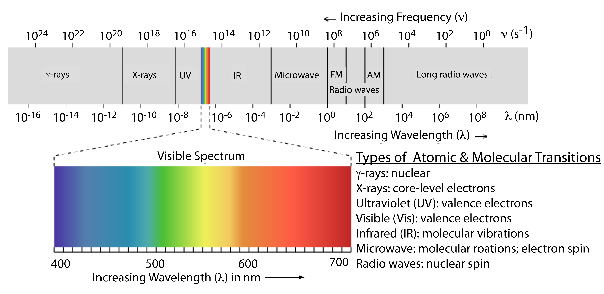

* electrical effects play an important role in the remote sensing

  * Coulomb's law $F=(q_1 q_2)/(4πεr^2 )$. 
  * The permittivity $ε=ε_0*ε_r$, with the electric constant, and is complex and the magnitude varies by the object. For example,  in the mean water level is 81, which is rather large.

* magnetic effects can be neglected in remote sensing

  * In the static magnetic field, ${\vec{B}}=\mu _r∙\mu _0∙\vec{H},$, With $μ_r$ the permeability and $μ_0$ the magnetic constant, and the permeability varies little for the most important types of matter.
  * permanent magnet

### oscillations and waves 

* the difference between oscillation and wave
  
1. Oscillation is the periodical transfer of energy inside the system, two forms: potential energy and kinetic energy.
2. Waves are oscillation propagating through space, which means without oscillation there will be no wave.
3. Waves depend on location, time and transport energy. In another word, waves are classified into transverse and longitudinal while no such classification exists for oscillations.

* wave equation for EM-wave in vacuum

  * the complex natation is advantageous, only real part is of physically of interest
  * angular frequency $ω=2π/T$
  * wave number $k=2π/λ$

* properties of periodic and plane EM waves

  * $E, B, r$ - right hand rule
  * velocity of light
  * transport energy
  * E-field and B-field are in phase
  * plane of E-field oscillation defines polarization plane

* relationship between wavelength and frequency $λ*f=c$  
  velocity of light depends on refraction index at surfaces

* Wave Propagation - Huygens's principle
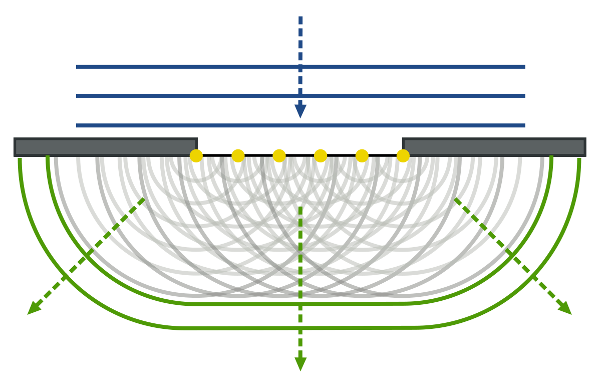
  * Each point on wave front is a source of new elementary wave (diffraction)
  * Wave fronts are interacted by coherent superposition (interference)

### radiation budget

* radiometry
    * measurement of electromagnetic radiance
    * emits radiance depending on its temperature  
      idealized pbject model: Black body(black body radiation)

      * Wien's displacement law: The frequency of maximal radiance is proportional to temperature
      * Stephan-Boltzmann law: The total amount of thermal radiation emitted is directly proportional to the fourth power of its absolute temperature

* radiation Budegt equation $Φ_iλ=Φ_rλ+Φ_aλ+Φ_tλ$

$$
\begin{aligned}
&\rho_{\lambda}=\frac{\Phi_{r \lambda}}{\Phi_{i \lambda}} \quad \text { reflectivity (also reflectance) }\\
&\alpha_{\lambda}=\frac{\Phi_{a \lambda}}{\Phi_{i \lambda}} \quad \text { absorptance }\\
&\tau_{\lambda}=\frac{\Phi_{t \lambda}}{\Phi_{i \lambda}} \quad \text { transmittance }
\end{aligned}
$$

  1. $Φ_iλ$ is the incident (incoming) radiant flux, defined as the amount of energy per unit time (i.e., power).
    $ρ_λ+α_λ+τ_λ=1$
  2. $Φ_rλ$ is the amount of power reflected from the object.
  3. $Φ_aλ$ is the amount of power absorbed by the object.
  4. $Φ_tλ$ is the amount of power transmitted from through the object.

### interaction of waves with matter

#### general remarks
  * the energy of the EM wave is proportional to frequency: $E = h*f$, long wave MW have far less energy than visible light
  * interaction of EM wave with molecules分子
    * optical domain/ infrared (VIS, NIR-FIR): in particular sensitive to chemical object structure
    * thermal radiance TIR热辐射: localize natural and anthropogenic heat sources
    * microwave domain MW: sensitive to conductivity, roughness, morphology

#### diffraction
  * fan out of wave behind obstacles
  * huygens principle
    * every point on the wave front is source of new elementary wave
    * wave front propagates by coherent superposition/ interference
  * Which physical effect determines angular resolution of an imaging sensor? How can we improve such resolution without changing signal wavelength?
  
  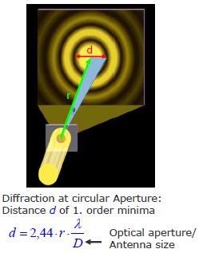  
    1. Diffraction effect determines the angular resolution of an imaging sensor, because the narrower the slit, the more wave will fan out.  
    2. angular resolution: $∆θ=1,22*λ/D$, with λ the wave length of signal, and D the antenna size (the optical aperture).  
    3. If we want to improve such resolution without changing signal wavelength, we can increase the size of optical aperture 光学孔径

#### absorption/emission
  * energy transfer from wave to matter
  * subtractive color by absorption: CMYK
  * penetration of EM waves into Matter 穿透
    1. penetration proportional to wavelength
    2. microwaves: dependence on moisture 水分

#### scattering
  * change of EM direction at particles in the atmosphere(Molecules, water droplets)
  * the radiance becomes absorbed and is immediately emitted again
  * Energy and wavelength remain the same, direction may change
  * rayleigh-scattering
    1. object size is small compared to wavelength
         * molecules in visible domain
         * raindrops in microwave domain
    2. strongly dependent on wavelength  
      blue sky - shorter blue wavelength scatters more
    3. large wavelength signal can penetrate clouds
  * Mie-scattering  
    Mie scattering is elastic scattered light of particles that have a diameter similar to or larger than the wavelength of the incident light.  
    The Mie signal is proportional to the square of the particle diameter.  
    Mie scattering is much stronger than Rayleigh scattering and, therefore, a potential source of interference for this weaker light scattering process.

#### reflection and refraction
  * Light = Elektro-magnetic Wave
    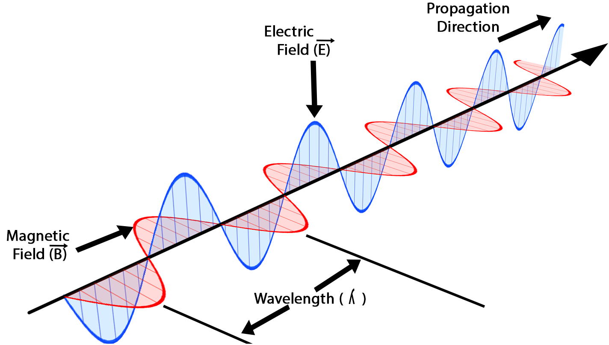  
  * at surface boundaries
  * polarization
     
    1. polarization linear
      * light maybe polarized
      * polarization filter
        * effect of filter depending upon rotation
        * 2 linear polarizing filter with 90 difference in direction - no lights go through
        * 2 linear polarizing filter with any other difference in rotation - intensity reduced
      * separation of stereo images
    2. circular (3D glasses)  
      electric and magnetic field are permanently changing
    3. elliptic
  * velocity of light depends on matter
    * the frequency remains, the wavelength becomes smaller
    * the refraction index is a function of wavelength
    * disperion, prism
  * snell's law of refration: $n1*sin(α)=n2*sin(β)$
  * cause of refraction
    * wave front hits surface oblique
    * dipoles inside matter are forced to oscillate
    * the change of velocity of light causes change of direction
    * brewster's angle
    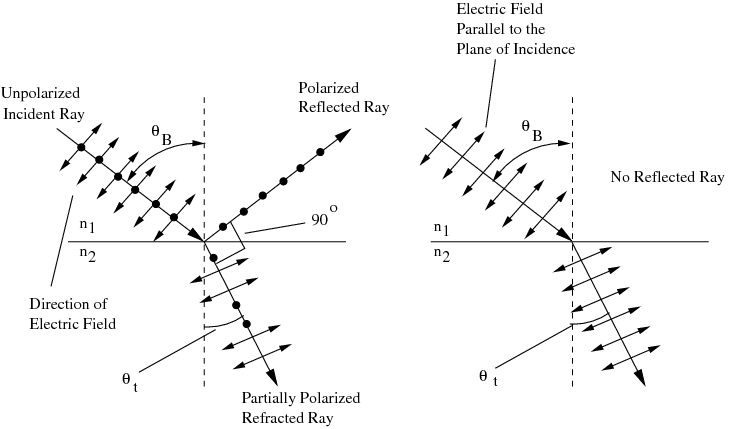  
    * BRDF (Bidirectional Reflectivity Distribution Function): $R(Θ,Φ,θ,φ)$
    * influence of surface roughness
      
      * rough surface - Diffuse reflection is the reflection of light or other waves or particles from a surface such that a ray incident on the surface is scattered at many angles rather than at just one angle as in the case of specular reflection.
      * smooth surface - specular reflection
      * Roughness Criterion: 
$$\sigma_{h}>\frac{\lambda}{8 \cdot \cos (\theta)}$$  
  $σ_h$: the standard deviation of the roughness height regarding to a reference height  
  $θ$: the local incident angle

### various kinds of resolution
* digitalization = sampling and quantization
* sampling
  * spatial resolution
  * spectral resolution
  * temporal resolution
* quantization: radiometric resolution
* the difference between spectral and radiometric resolutions
  * Spectral resolution is the number and width of spectral bands
  * Radiometric resolution tells how many grey values (depends on the number of bits) can be coded, this resolution against to the same spectral band

## image processing
### introduction
* acquisition of object features in image
  * information carrier - electromagnetic radiation of specific wave length​
    * reflected radiation: sunlight, laser, radar impuls
    * projected radiation: X-ray device, computer tomography
    * remitted radiation: thermal radiation
  * recorded data - EMR energy or a value proportional to EMR energy​
  * sensor
    * photographic film
    * electric sensors
    * radar: antenna and high frequency electronics
  * result
    * film
    * CCD
    * brightness
    * prior to processing(and storage) analogue-digital(A/D)-conversion(digitisation) required
* image after digitization
  * sample: spatially discrete
  * quantized: discrete in energy values
  * image elements - pixel
* topics of digital image processing
  * input image - processing - output image
  * correct errors during acquisition by calibration
  * modify colour/grey values by scaling
  * transform to co-register images
  * eliminate errors by filtering
  * segment structures
  * code images and image sequences, storage

### image acquisition - CCD and CMOS technology
* inner photoelectric effect
* linear CCD sensor
  * sensor moves along track, image generated line by line
  * no shutter required
* CCD matrix sensor - interline transfer technique
* spectral sensitivity, problem
  * photo diodes are sensitive for entire visible spectral domain
  * in order to take color images mostly filters are used
    * remote sensing: multi and hyperspectral images
    * displays lick screen or beamer
      * only 3 colour: RGB
      * color perception by additive color mixing

* The spatial resolution of hyperspectral bands is often lower than the resolution of panchromatic band
  * hyperspectral bands have narrow bands so that they receive less energy. The percent of noise gets higher. To solve this problem we have to enhance the Signal-to-noise ratio(SNR), for this purpose, we have to enlarge the size of the chip (pixel size). The chip can receive more energy. And because the size of the chip gets larger, the resolution of hyperspectral bands gets lower.
  * For panchromatic bands, we merge the visible bands(RGB). The energy is enough to get the high SNR. So we can use smaller chips. So that the resolution is better.
  
* HSV color model - cylinder coordinates systems
  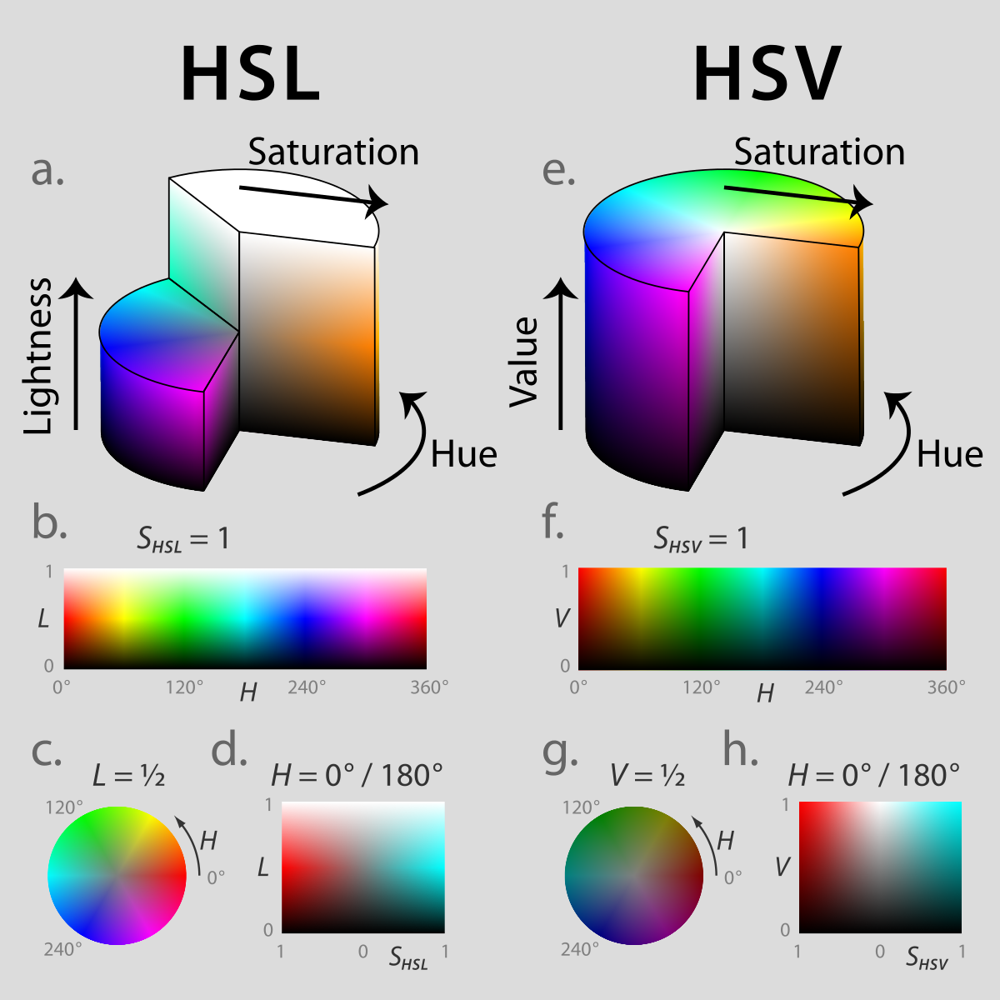  
  * Hue is the value index of color, one hue represents one color
  * Saturation defines the level of color, describes how colorful one color is
  * Value equals the lightness of the color, defines how light or how dark the color is
  
* pan sharpening of optical satellite images take place in IHS space
  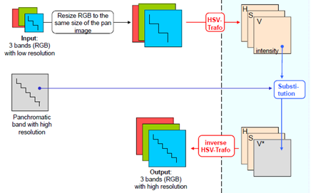  
  * Pan-sharpening is a process of merging high-resolution panchromatic and lower resolution multispectral imagery to create a single high-resolution color image.
  * Pan-sharpening produces a high-resolution colour image from three, four or more low-resolution multispectral satellite bands plus a corresponding high-resolution panchromatic band:
  * Low-res colour bands + High-res grayscale band = Hi-res colour image
  * steps
    1. oversample RGB channels to resolution of pan channel
    2. transform RGB to IHS(Intensity, Hue, Saturation)
    3. exchange I with pan channel(I')
    4. transform I'HS to R'G'B' image(pan sharpened image)
   * fuse geometry and color data

* spectral sensiticity of CCD-sensor
  * spectral response for CCD sensors in relation to photography and human eye(400-700nm, RGB)
  * colour infromation only can be based on colour filters in front of CCD

* separation of spectral bands(color)
  * three layer ship: penetration depth depends on wavelength, 2 color sensitive layers vertically, expensive
  * color mosaic(Bayer Pattern)
    * single chip with color filters on pixels
    * later interpolation to full image size
      * lower real resolution
      * green domaintes(brightness)
      * cheap, mostly uesd for consumer grade cameras
      * 2 green: human vision more sensitive to green real resolution
  * color bands
    * panchromatic 400-900nm
    * blue 400-580nm
    * green 500-650nm
    * red 590-675nm
    * near infrared 675-900nm
  * how many combinations(TM)?
    * combinatorics : draw k elements form set of n bands
      $$\frac{n !}{(n-k) ! \cdot k !}$$
      TM: n= 7, k= 3
    * possible ways of visualization
    $$\frac{n !}{(n-k) ! \cdot k !} \cdot k !=\frac{n !}{(n-k) !}, \text { here: } 35 \cdot 6=\underline{210}$$
    remote sensing: 321/432

* ground sampling distance(GSD): distance of pixel centers on ground
* diffraction limits angular resolution
  * the real or effective resolution may be worse than GSD
  * on the other hand, there is no point in choosing GSD smaller than diffraction limit
  * diffraction at circular aperture: distance d of 1. order minima: $d=2.44*r*λ/D$
* resolution should match the desired application
* for recognition of a certain object, we need a handfull pixel

### characterisation of digital images
* average grey value - the average of all grey values of an image describes the general brightness of image: $\mu=\frac{1}{X \cdot Y} \cdot \sum_{x} \sum_{y} g(x, y)$
  * dark image <<127
  * bright image >>127
  * homogeneous image(average) 127
* varaince $\sigma^{2}=\frac{1}{X \cdot Y-1} \cdot \sum_{x} \sum_{y}(g(x, y)-\mu)^{2}$
  * global measure for grey valure deviation from $μ$
  * related to the contrast $K$ of an image: $K=(g_{max}-g_{min})/(g_{max}+g_{min})$
  * varience of a homogeneous grey value image of arbitrary brightness $σ^2 = 0$
* covariance(similarity)
* correlation coefficients(similarity)
  * qualitative measure of similarity, no quatitative result due to lack of normalization
  * correlation coefficient $ρ_{g_1 g_2}$ of two images $G_1$ and $G_2$: [-1,1]  
    the ratio between covariance and product of standard deviations of both images
    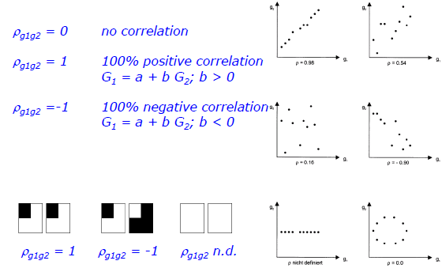  
* histogram
  * average $μ$ and variance $σ^2$ only allow for rather general characterisation of an image
  * histogtrams deliever more detailed information about the number of pixels with a certain gray value $g_i$
  * relative grey value occurrences $p(g)=a(g)/n, [0,1]$
  * histogram: visualisation
    * a hisogram does not contain information about the sptial distribution of grey values in the image
    * lose the geomatic information
  * histogram stretch

### point operations
* homogeneous
  * only original grey value influences results, position does not
  * transformation using charcteristic curve - the change of gray values from g1 to g2
    * inversion: $g_{2}(x, y)=-g_{1}(x, y)+255$  
    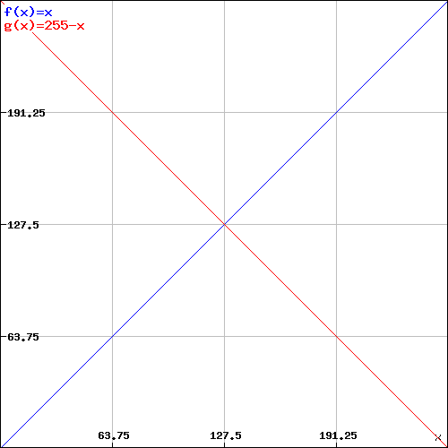  
    * lineal scaling: $g_{2}(x, y)=\left(g_{1}(x, y)+k_{2}\right) \cdot k_{1}$  
    $k_{2}>0$ makes image brighter  
    $k_{2}<0$ makes image darker$  
    $k_{1}>1$ enhances contrast$  
    $k_{1}<1$ reduces contrast$  
    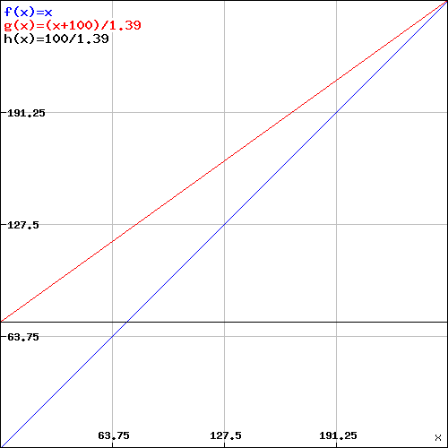  
    problem: g2 can become smaller than 0 or larger than 255
    * characteristic curves: piecewise linear scaling  
    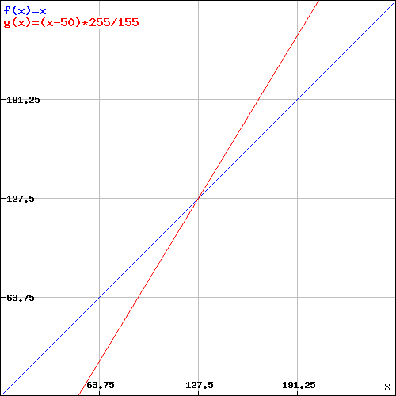  
    $g_{2}(x, y)=\left\{\begin{array}{cccc}
0 & \text { if } & \left(g_{1}(x, y)+k_{2}\right) \cdot k_{1} \leq 0 & k_{1}=\frac{255}{g_{\max }-g_{\min }} \\
\left(g_{1}(x, y)+k_{2}\right) \cdot k_{1} & & \\
255 & \text { if } & \left.g_{1}(x, y)+k_{2}\right) \cdot k_{1} \geq 255 & k_{2}=-g_{\min }
\end{array}\right.$
      * enhancement of interesting region only
      * also non-linear function e.g. gamma correction
      * often coded in LUT
  * histogram normalisation
  * transformation using look-up tables
  * algebraic transformations

* inhomogeneous
  * local filter operations: a mixture of both
    * neighbourhood around current pixel is considered
    * neighbourhood is defined via a window(filter mask)
    * filter mask is continuously moved across the image
  * linear filtering
    * lineal digital filters h(x,y) carry out convolution operations on the image g(x,y) - convolution with $3 \times 3$ - filter
    $$g^{\prime}(x, y)=g(x, y) * h(x, y)=\sum_{i=-1}^{i=1} \sum_{j=-1}^{j=1} g(x+i, y+j) \cdot h(-i,-j)$$
      use of local filters: smoothing, enhancement of specific features
  * low pass filter - smoothing
    * Different position - different opeators
    * Homogeneouspoint operator - global calculation - take all the grey values intoconsideration
    * Inhomogeneouspoint operator - only consider the local part - depends on original grey value and position in image - low pass filter
    * reduce high frequency information
      * visiual imprression becomes softer
      * edges are smoothed
      * details and noise are reduced
      * no effect in homogeneous areas
      * overall brightness constant
    * box operator: $\frac{1}{9}\left[\begin{array}{lll}1 & 1 & 1 \\ 1 & 1 & 1 \\ 1 & 1 & 1\end{array}\right]$
      * Disadvantage: not rotation invariant, does not suppress all high frequencies
      * Advantage: recursive implementation possible
    * gauss operator
      * stay same in both domains
      * Advantage: rotation invariant, suppresses all high frequencies
      * Disadvantage: only approx. recursive implementation - binomial filter
    * binomial filter: $b_{2,2}=\frac{1}{16}\left[\begin{array}{lll}1 & 2 & 1 \\ 2 & 4 & 2 \\ 1 & 2 & 1\end{array}\right]$
      * discrete approximation of gauss filter, recursive implementation possible
      * 2D-Filter: separable in two 1D functions
  * High pass filters - edge detection
    * prewitt-operator
      * simple realization: $h_x=0.5*[-1\quad 0\quad  1], h_y=0.5*[-1\quad 0\quad  1]'$
      * differencing enhances noise - noise suppression by low pass filtering(smoothing) in across direction
      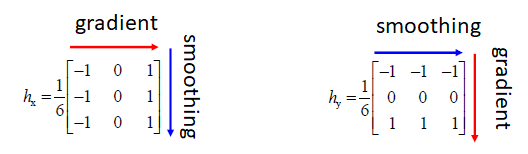 
      * filtering in both directions
      * amplitude and direction of gradient
      $$g_{MAG}=sqrt(g_x^2+g_y^2)\\g_{DIR}=arctan(g_y/g_x)$$
    * laplacian operatoer - image sharpening
      * use superposition principle of linear filters
      * image sharpened by adding high-pass component from Laplacian
      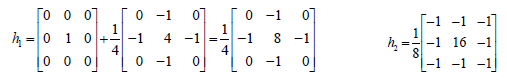 

### geometric transformation
* spatial transformation using a mathematical function
  * simple geometric transformations  
  translation: $\left(\begin{array}{l}x_{2} \\ y_{2}\end{array}\right)=\left(\begin{array}{l}x_{1} \\ y_{1}\end{array}\right)+\left(\begin{array}{l}d x \\ d y\end{array}\right)$
2 degrees of freedom $\left(\mathrm{d}_{\mathrm{x}}, \mathrm{d}_{\mathrm{y}}\right)$  
scaling:
$\left(\begin{array}{l}x_{2} \\ y_{2}\end{array}\right)=\left(\begin{array}{ll}s_{x} & 0 \\ 0 & s_{y}\end{array}\right) \cdot\left(\begin{array}{l}x_{1} \\ y_{1}\end{array}\right)$
2 degrees of freedom $\left(s_{x}, s_{y}\right)$  
skew:$\left(\begin{array}{l}x_{2} \\ y_{2}\end{array}\right)=\left(\begin{array}{ll}1 & b_{x} \\ b_{y} & 1\end{array}\right) \cdot\left(\begin{array}{l}x_{1} \\ y_{1}\end{array}\right) \quad 2$ degrees of freedom $\left(b_{x}, b_{y}\right)$  
rotation:
$\left(\begin{array}{l}x_{2} \\ y_{2}\end{array}\right)=\left(\begin{array}{cc}\cos \alpha & \sin \alpha \\ -\sin \alpha & \cos \alpha\end{array}\right) \cdot\left(\begin{array}{l}x_{1} \\ y_{1}\end{array}\right)$
1 dof. $(\alpha)$
  * further sptial transformations  
  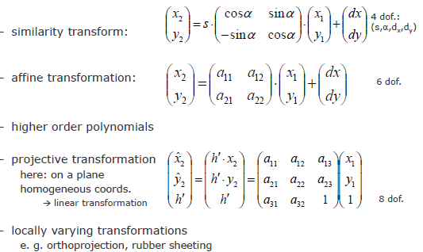 
* grey value determination
  * general spatial transformation results in the change from integer to non-integer positions
  * indirect method
    * compute inverse transformation T-1
    * determine grey valued for each position in target image - no holes
  * nearest neighbour interpolation
  * bilinear interpolation - two dimensions
  * Bicubic interpolation: The new grey value is interpolated from the neighbouring 16 values

## Optical Satellite sensors
### motivation: mapping from space
* terrestrial and airborne mapping cannot deliver information necessary for sustainable development on global scale
* monitoring of climate change
* rapid hazard response
* large scale mapping
  
### some technical issues
* geostationary satellites - orbit in 36000km altitude
* sun-synchronous orbit
  * revolution takes about 90-100 minutes in 500-900km altitude
  * inclination about 98° with respect to equator
  * Step by step the entire globe is mapped (except poles)
  * Pass over always at same local time (optical: acquire only images on dayside)
* image acquisition in the morning: data take approximately at half past 10 a.m.(equator)
  * earlier: shadows too large
  * later: too many clouds due to evaporation
* data broadcasted to ground stations
* direct sensor orientation: gyros (for determination of attitude change), star sensors and positioning system 
* opto-mechanical sensor (Whiskbroom Scanner/Cross-track scanner, back and forth)
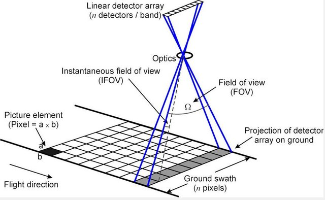
* Linear CCD Array (push broom scanner/along-track scanner)
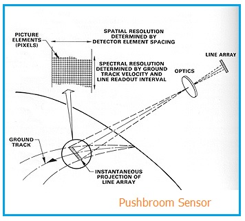
* pixel size on the ground $p = δ * H/c$: Ground samping distance - usually nadir view
  $$\frac{p}{H}=\frac{\delta}{c} \rightarrow p=\frac{\delta \cdot H}{c}$$
  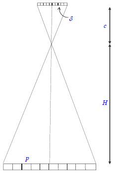
  * size of sensor elements $δ$
  * focal length of sensor $c$
  * altitude $H$
* TDI sensor: time delay and integration sensor
  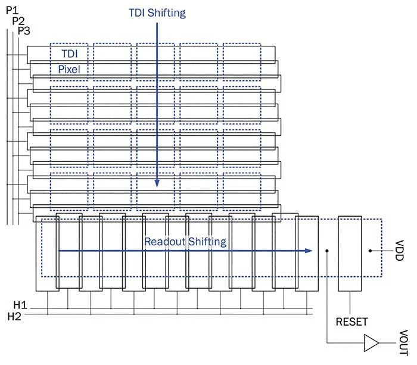
  * 1m pixel size corresponds to 0.14 ms (~7km/s)
  * longer integration time by shift of charge corresponding to speed of image movement on sensor
* sensor geometry: focal plane, merged image line
* correction of earth's rotation effects: fill in pixels are critical for classification, use only for visualization
* orthophoto: correction of perspective effects
  * Digital Terrain model: comon orthophoto
  * digital surface model: true orthophoto

### multispectral satellite sensors
* optical high resolution satellite sensors
  * use linear CCDs and are on sun-synchronous near-polar orbits
  * most multispectral systems have 4 channels (RGB, near IR)
  * accuracy on the ground depends on available additionnal information(GCP, DTM) - Geo-coding
  * product specifications and availability varies, in particular: camera model, raw imagery, stereo imagery
  * prices quotas vary with location, time to delivery and size
  * value-added products(orthoimages)
* space imagery can be obtained only at regular intervals
* cannot be obtained on demand in real-time
  * celestial mechanics
  * ordering restrictions - one sensor for many users

### indices NDVI: $\mathrm{NDVI}=\frac{\mathrm{NIR} \cdot \mathrm{Red}}{\mathrm{NIR}+\mathrm{Red}}$

* advantage of index(Ratio)
due to different illumination, the same land cover has different grey values in band A, same problem for band B. However, in the ratio image of the two bands, i.e. band A/band B, we have similar grey values for each class.
* normalized difference Vagetationindex(NDVI) = $(Band 4 - band3)/ (Band 4 + band3), [-1, +1]$  
band 4 near infared, band 3 red  
NDVI=-1: black, NDVI= 1: white  
a larger NDVI value indicates higher vitality

### hyperspectral sensors
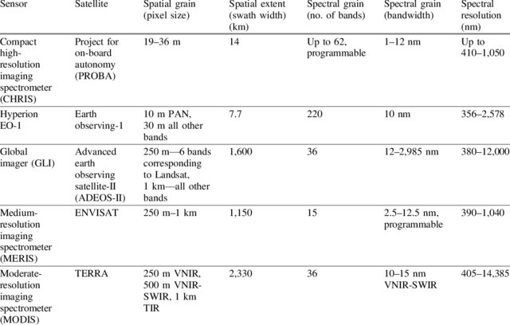

### depth from stereo: two images requied of sufficient: overlap, baseline

## Classification

## airborne laser scanning

## radar