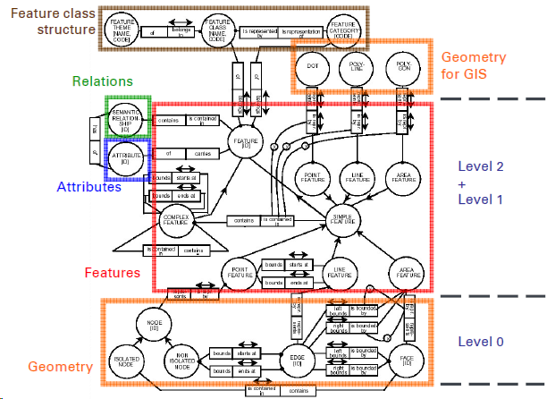

# Transport Telematics

===
Source: Dr.-Ing. Martin Metzner, Transport Telematics  
<https://www.iigs.uni-stuttgart.de/lehre/geoengine/transport_telematics-ws/>  
Outline: Zhouyan Qiu, msqiuzy@outlook.com

## introduction

### motivation

* telematics is transportation and processing of information and advanced telecommunication services - long distance data exchange
* transport telematics is acquisition, processing and transmission of transport relevant data and information
* application: traffic guidance systems, driver assistance systems
* why transport telematics: ensure mobility
  * enhancement of safety
  * increase of efficency
  * reduction of adverse impacts on environment

### obstacles for transpot telematics

* supply of necessary data with sufficient quality
* organizational and legal barriers/vagueness
* refinancing of development costs of telematic systems
* cost-covering operation of telematic services
* missing harmonisation and standardisation
adverse impacts due to incresing complexity and cross-linking of the components

### intelligent transport systems(ITS)

add information and communication technologies to transport infrastructure and vehicles

### Functional architecture of a navigation system

### data & information

data: a formalized collection of facts, concepts, and instructions, usable for communication or processing by humans or automated methods  

information: purpose-oriented knowledge necessary for acting to reach the intended aims  
information results from the application of rules and instructions on data

## digital maps

### classification of maps and geodata

* format: raster data, vector data
* type: cadastral map, city map, aerial photos/satellite images
* coordinate system/map projection: Gauß-Krüger/WGS84/UTM
* content: features, attributes
* source: public, commercial

### GDF

#### data structure

  

* objects/features
  * road elements/roads
  * junctions/intersections
* attributes
  * street name
  * direction of the traffic flow(DF)
* relation
  * turn restrictions

#### division into three levels

  

* geometry - level 0
  * basic geometry/topological primitives, nodes, edges and faces
  * coordinates define spatial arrangement
* simple features - level 1
  * points, lines and areas
  * every feature represents one object given in reality
* complex features level 2
  * put together using simple features
  * description of the road network from the view of the driver

#### acquisition of road geometry

  

* road element consists of edges
* edges represents the centreline of the carriageway
* separated carriageways - two road elements are captured
* edges have to be completely inside the carriageway

#### modelling of traffic flow - directed graph, direction by digitization

#### attribute model

* each feature can carry any number of attributes
* attribute belongs to a feature, has exactly one type and one value(but can be complex)
* concepts: complex, segmented, time-dependent

#### segmented attributes - different parts of the object

  

* absolute segmentation: related to the length in the geometrical representation(from a defind start point)
* relative segmentation: related to measured length by a percentage value
* advantage: less notes, less processing time

#### data model for semantic relations

* connection of two (n) objects
* relationship contains attributes, a name and a code such as features
* with relationships turns are modelled
  * prohibited manoeuvre
  * restricted manoeuvre
  * priority manoeuvre

#### topology is a branch of mathematics that is an extension of geometry

  

* 3 levels: geometry(line, node, equal coordinate) - direction of traffic flow - relations
* topology from geometry
  * same nodes from two edges
  * two areas border on the same edge
* topology from thematic
  * road element is specified as one way by attribute DF
  * prohibited manoeuvre by relationship

#### GDF

* Data exchange format: simplified representation of the Media Record specification for line features
* one standard - two maps
  * different interpretation of the rules for acquisition
  * different acquisition tasks
  * usage of different data sources
  * completely independen acquisition
* acquisition
  * secondary data captureing by ortho photos, topographical maps and import of digital data bases
  * adding primary data capturing is necessary
    * attributes of road elements
    * turn restriction
    * signage
  * application of mobile mapping vehicles
    * metrological acquisition of road geometry by an positioning system
    * acquistion of road related attributes and relationships by geo coded video images

#### ATKIS - official topographic cartographic information system

* object-based, signature-based and picture-based presentation of the earch's surface
  * digital landscape model(DLM)
  * digital topographic map(DTK)
  * digital terrain model(DGM)
  * digital ortho photo(DOP)
* object catalogue - essential data are missing(e.g. oneway streets, turn relations): ATKIS data are not suitable for navigation and routing  
    
* feature representation of roads  
    
  * road
    * linear
    * complex feature composed of centre lines(represent spatial basic feature)
  * road with divided carriageway
    * linear and areal
    * road is a complex feature composed of carriageway axes(for both directions) and a centre line(midway division)
    * areas between are classified with feature type(road traffic)

#### GDF & ATKIS - difference in data model

  

### OKSTRA - Feature catalogue for road engineering and transportation

* realization of a continuous information flow by data exchange without lost of any data and information
* concerned parties
  * surveying agencies, road administration, federal government, federal states and municipalities
  * planning and engineering offices, commercial suppliers of map series

### Openstreetmap - more users, more detailed, may have mistakes, license model

* collaborative project to create a free editable map of the world
* OSM has all rights to the data
* congested urban areas are good acquired, other regions are acquired only partly or not at all
* data Model
  * own data model realized in XML
  * points(node), lines(way) and relations are available
  * no restrictions on attributes for the objects - differend by tags
* data format
  * export in common raster data - jpg, png, pdf
  * export in vector based format(XML)
  * convert OSM in common geodata format like GML, KML, SHAPE...
* license - open content license, the author has no copyright

### NDS - navigation data standard

* NDS association member: car manufacturers, application/compiler developers, map data providers, service providers
* comparing to GDF: new support for road conditions(more lines to represent the road)
* challenge
  * localize the user's own car
  * to plan the path on streets
* Open Lane Model
  * Improves localization and path planning on routes
  * stores lane topology and high-precision geometries of up to 1-cm resolutions
  * assign standard attributes, such as speed limits, to lanes with high accuracy
  * the model shows boundaries, such as walls or tubes and colored lane markings
  * complex intersections are described by a sophisticated connectivity model
  * faces two challenges of autonomous driving: to localize the user’s own car and to plan the path on streets

### geographic data

#### dimension

 * 0D - POI - point
 * 1D - road - line
 * 2D- area of soil - polygon
 * 2.5D - (x, y, name, height)
 * 3D (x, y, z) TIN

#### scale

 * scale is in the detail - spatial resolution or the level of detail in data
 * scale is about extent - large scale project covers large area
 * scale of a map - representation fraction: the ratio of distance on the map to distance on the ground

#### georeference

* requirement
  * unique, one location associated with a given georeference
  * shared meaning
  * persistent through time
* georeference without metric
  * problem: name change
  * postal address, postal code...
* georeference with metric
  * problem: change of the definition of the system + yearly continious changes
  * lablic land survey system, latitude/longitude...

#### types of attributes

* nominal: identify or distinguishi one entity from another, includes numbers, letters, and even colors
* ordinal natural order, averging make no sens
* interval: the diference make sense: the scale of Celsius temperature
* ratio: eg. weight
* cyclic: categories beyond these four mention above(e.g. traffic flow direction)

#### geometric primitives: point, line, polygon

#### topological primitives: node, edge, face

#### geometry classes defined by the OGC: definition is used in databases(like PostGIS, MYSQL,...)

### data model

* a set of constructs for describing and representing selected aspects of the real world in a computer
* provides systems developers and users with a common understanding and reference point
* there is no single type of all encompassing GIS data model that is best for all circumstances
* 4 levels of abstraction relevant to GIS data models  
    
    
* object-oriented concepts in GIS
  * an object is a self-contained package of information describing the characteristics and capaibilities of an entity
  * an interaction between objects is called a relationship
  * a collection of objects of the same type is called class.
  * each class/object might include properties defining its state
  * each class/object might include methods defining the behavior
  * three key facets of object data models
    * encapsulation: describe the fact that each object packages together is a description of its state and behavior
    * inheritance: the ability to reuse some or all of the characteristics of one object in another object
    * polymorphism: describe the process whereby each object has its own specific implementation for operations
* database management system(DBMS)
  * relational(RDBMS)
    * set of tables, each of a 2D list of records containing attributes about the objects under study
    * simple, flexible, and useful structure
  * object(ODBMS) - address weaknesses of RDBMS
    * the inability to stor complete objects directly in the database
    * deal with rich data types such as geographic objects, sound and video
    * poor performance of RDBMS for many types of geographic query
  * object-relational(ORDBMS)
    * a RDBMS engine with an extensibility framwork for handling objects

### requirement engineering(RE)

* objective
  * selected aspects for spatial data related projects are to understand
  * aspects of functional requirement analysis(requirement engineering, data cost, and data quality) are important
* requirements engineering - design - implementation - final check
* important techniques and methods
  * research techniques - analysis of requirements
  * modeling methods - requirements are documented and structured(e.g. UML)
* Customers requirements regarding the system are to be documented completely, free of contradictions and auditable within the summary of the specifications(detailed description of the services)

### data quality

* definition
  * totality of characteristics of an entity that bear on its ability to satisfy stated and implied needs
  * Degree to which a set of inherent characteristics fulfils requirements
  * avaliability, completeness and correctness
* quality model
  * dependability characteristics - discribe the time related aspect of information quality
    * availability, up-to-dataness
  * integrity characteristics - discribe the applicability of information
    * completeness, consistency, correctness
  * accuracy characteristics - describe the limitation of accuracy and resolution of measurement and interpretation
    * metric accuracy, semantic accuracy
  * Possible sources of error with GIS analyses
    

### data costs

*  basis costs: hardware, soft ware, personal costs
*  project specific costs

### topology

#### intruduction

* application
  * network: electric power supply, natural gas piprline, water supply/waste water, transportation networks
  * location: optimally locating p facilities to serve n customer demand at n > p locations
* topological properties
  * distinction between point, line, area (and volume)
  * adjacency, including the touching of land parcels, counties, and nation states
  * connectivity, including junctions between streets, roads, railroads, and rivers
  * containment, when a point lies inside rather than outside an area

#### OGC(open geospatial consortium) OpenGIS Simple Features Specification

* Spatial Relations - a and b are two geometries; I(x) ist the interior of x; dim(x) is the dimenson of x, or maximum dimension if x is the result of a relational operation
  * Spatially equal to: $a=b$
  * Spatial disjoint: equivalent to a $\cap \mathrm{b}=\emptyset$
  * Spatially touches: equivalent to $[\mathrm{a} \cap \mathrm{b} \neq \emptyset \text { and } \mathrm{I}(\mathrm{a}) \cap \mathrm{f}(\mathrm{b})=\emptyset] ;$ does not apply if a and b are points
  * Spatially crosses: equivalent to $[\operatorname{dim}(|(a)) \cap \operatorname{dim}(|(b))<\max \{\operatorname{dim}(|(a)), \operatorname{dim}(|(b))\} \text { and } a \cap b \neq a \text { and } a \cap b \neq b]$
  * spatially contains: [a contains(b)] is equivalent to [b within(a)]
  * spatially within: within(b) is equivalent to $[a \cap b=a \text { and }|(a) \cap|(b) \neq \emptyset]$
  * spatially overlaps: equivalent to $[\operatorname{dim}(|(a) \cap|(b)=\operatorname{dim}(|(a))=\operatorname{dim}(|(b)) \text { and } a \cap b \neq a \text { and } a \cap b \neq b]$
  * spatially relates, tested by checking for intersections between the interior, boundary and exterior of the two components
* Spatial analysis
  * the shortest distance between any two points in the two geometries as calculated in the spatial reference system of this geometry
  * Buffer: all points whose distance from this geometry is less than or equal to a specified distance value
  * the convex hull of this geometry. For point sets in the plane the convex polygon of smallest area that completely encloses the set (it may also be used for line and polygon sets)
  * the point set intersection of the current geometry with another selected geometry
  * the point set union of the current geometry with another selected geometry
  * the point set difference of the current geometry with another selected geometry
  * the point set symmetric difference of the current geometry with another selected geometry (logical XOR)
* Dimensionally Extended Nine - Intersection Model - DE-9IM
    

#### topology of a network

* techniques developed for graphs
  * measuring connectivity
  * finding shortest path
  * Network connectivity
  * Network distance
  * Traveller salesman problem
  * Distance analysis
  * Optimum “place” analysis
* terminology  
      
      
      
      
  * GDF
    * 0 Dimensional: point, node(vertex), junction
    * 1 Dimensional: line(polyline), edge, road elements
    * 2 Dimensional: polygon, face, area
* incidence and adjacency  
    
  * Incidence names the meeting of different topologic primitives
    * Incidence matrix 
      * $B(i, j)=1$ if edge i starts in node $j$ 
      * $B(i, j)=-1$ if edge i ends in node $j$
  * Adjacency names the meeting of same topologic primitives
    * Adjacency matrix
      * Main diagonal contains number of adjacent nodes
      * Nodes adjacent to each other -1
      * symmetrical
    * The adjacency matrix A can be calculated directly from the incidence matrix
  * Pointer structure
    * edges: Edge_Id \{Node_Id, Node
    * nodes: Node_Id \{Edge_Id, Edge_Id, $\ldots \ldots .\}$
* Requirements of transportation network
  * Topological correct street network: Feature model: Junction / Road elements
  * Network is „orientated“ For each road element a start- and end-junction is defined
  * Attributes can be modelled “orientated”
  * The concept of segmented attributes is realised
  * Semantic relations are supported to define manoeuvres
* digitalization of a street network
  * Hints for manual digitization
    * Produce a correct topologic geometry
    * Set junction points first! (Time consuming)
    * This is definitely necessary at complex crossings!
    * At simple crossings you may use GIS functions to generate the crossings!
  * Complex crossing
    * set all juction crossings
    * snap on the crossings
  * simple crossing
    * digitizing the roads
    * generate the crossings automatically
* network analysis
  * Some key optimisation problems in network analysis
    * Hamiltonian circuit (HC) - all nodes, bussiness man  
      
    If a cycle exists from a given vertex that passes through every other vertex exactly once it is called a Hamiltonian circuit. Testing for the existence of Hamiltonian circuits in a graph is known as the Hamiltonian circuit problem (HCP).
    * eulerian circuit(EC) - all network at one time, postman
      
    A circuit in a directed graph that visits every arc exactly once. A condition that a graph contains an Eulerian circuit is that the number of arcs arriving at every included vertex, i, must be the same as the number of arcs leaving vertex i
    * shortest path(SP) - time or distance
    A path between two vertices that minimises a pre-defined metric such as the total number of steps, total distance or time, is called a shortest path. Hence this term is relative to the metric applied and even then may not be unique for any given network. Determination of shortest paths is often described as shortest path analysis (SPA). This is perhaps the central computational problem in network analysis. There are many variants of this problem, including finding the 2nd, 3rd… nth shortest path, finding the shortest path from a given node to all other nodes, and finding the longest path. Can be solved in linear time or better
    * spanning tree(ST)
    Given a fixed set of vertices, find a set of edges such that every vertex is connected and the network contains no cycles. Many spanning trees are possible for a given vertex set
    * minimal spanning tree(MST)  
      
    Find a (Euclidean) spanning tree of minimum total length. Typically this will be unique, but uniqueness is not guaranteed. Solvable in near linear time
    * Steiner MST, Steiner tree
      * As per the MST but with additional nodes permitted that are not co-located with the original vertex set.
      * In the (spatially) constant cost model, each additional point (known as a Steiner point) will be placed intermediate to three existing vertices and will provide a connection between these via three branches that are equally spaced (i.e. at 120 degrees) about the Steiner point.
      * Steiner points are added to the MST, replacing MST links, if the total network length is reduced by their inclusion.
    * Travelling salesman problem (TSP)  
      
      * Given a set of vertices and symmetric or asymmetric distance matrix for each pair of vertices, find a Hamiltonian circuit of minimal length (cost).
      * Typically the start location (vertex) is pre-specified and the vertices are not necessarily assumed to lie on a pre-existing network. If certain nodes must be visited before others, the task is known as a sequential ordering problem (SOP)
    * Transportation problem, Transshipment problem
      * The general problem of completely servicing a set of target locations with given demand levels from a set of source locations with given supply levels such that total costs are minimised is known as the transportation problem.
      * The unit cost of shipping from each supply point to each demand point is a key input to this problem specification. This problem is an example of a Minimum Cost Flow Problem (MCFP). A generalisation of the transportation problem is the trans-shipment problem. In the latter case flows from sources to targets can go via trans-shipment points, e.g. factories to warehouses to customers, rather than simply direct to customers
    * Vehicle routing problem (VRP)
      * This class of problems relates to servicing customer demand (e.g. deliveries of fuel to retail garages) from a single depot, where each vehicle may have a known capacity (CVRP).
      * If capacity is not restricted the problem is known simply as a vehicle routing problem (VRP). The number of vehicles and the number of tours of subsets of nodes are variables. The customer locations, depot location and customer demand levels are assumed to be known. The problem is to minimise the overall length of the tours, subject to the constraints.
      * There are many variants of this problem, notably those in which there are pre-defined time windows for deliveries, problems involving pickups and deliveries, problems involving a series of depots, problems where demand is dynamically variable, problems in which link capacity constraints exist and hence may become congested, and problems where customer locations are generalised rather than fixed.
    * Arc routing problem (ARP)
      * Given a network (typically a street network or subset of a street network) find a route that completely traverses every edge, generally in both directions, that has the least cost (distance or time) subject to selected constraints (e.g. cost of turning).
      * This problem applies to street cleaning, snow-ploughing, postal deliveries, meter reading, garbage collection etc. The capacitated version of the problem is known as CARP.
    * Facility location: p-median/ p-centre/ coverage
      * A collection of problems where the objective is to optimally locate one or more facilities within a network in order to satisfy customer requirements (demand, service level).
      * The most commonly cited problem is minimisation of total (or average) travel cost/time to or from customers (the p-median problem). Minimisation of maximum distance or time is known as a p-centre problem. A related set of problems seeks to ensure that all customers can be served within a fixed upper time or cost, or at least, as many as possible are served within a fixed time or cost. These are known as coverage problems.
      * They are not explored further in this lecture, mainly because their very restrictive constraints tend to generate solutions that are too costly or ineffective to be implemented in practice. Customer demand is often assumed to be located at vertices in which case p-median solutions for p facilities serving n>p customer sites will always result in the facilities being located at network vertices (although this solution may not be unique). It is the network equivalent of the plane or free-space median location problem — a form of location-allocation task whereby facilities are located and customers are allocated to facilities.
  * Sample network analysis problem parameters
    * Objective function: How do we measure the"length" of a path? Options include the Euclidean length, Lp length, link distance/time/cost etc
    * Constraints on the path: Are we simply to get from point s to point t, or must we also visit other points or other regions along a path or cycle?
    * Input geometry: What types of obstacles or other entities are specified in the input map?
    * Dimension of the problem: Are we in 2D-space, 3D-space, or higher dimensions? Typically within GIS we only consider 2D, but transport networks may not be planar
    * Type of moving object: Are we moving a single point along the path, or is movement specified by some more complex geometry? In GIS off-road vehicular modelling is usually performed using Accumulated Cost Surface (ACS) or Distance Transform (DT) procedures applied to grid datasets rather than vector networks. Constraints on routes may also be applied to vehicles of particular sizes, types or weights (e.g. height restrictions)
    * Single shot vs. repetitive mode queries: Do we want to build an effective data structure for efficient queries? Many network problems involve very similar searches — for example determining an alternative route (2nd, 3rd best)
    * Static vs. dynamic environments
      * Do we allow obstacles to be inserted or deleted, or do we allow obstacles to be moving along known trajectories?
      * Flow and event dynamics may also be important considerations
    * Exact vs. approximate algorithms
      * Are we content with an answer that is guaranteed to be within some small margin of optimal?
      * Larger problems in many cases cannot be solved exactly in a finite amount of time. Ideally real-world problems should be solved to within a specified level of the optimum for suitably defined subset problems
    * Known vs. unknown map
      * Is the complete geometry of the map known in advance, or is it discovered on-line, using some kind of sensor?
      * Typically the geometry is known (map-able) in advance, but flows or events may not be
* routing algorithm
  * finding an algorithm to calculate an optimal path is solved
  * The main problem is the organisation of mass data to guaranty a quick data access
  * Traveling-salesman problem (TSP)
    * a number of places must be visited in a tour from the depot and the distances between pairs of places are known
    * select the best tour out of all possible orderings, in order to minimize the total distance traveled
    * if n places to be visited, including the depot, then there are (n-1)!/2 possible tours
    * this number grows very rapidly (n=5 - 12; n=8 - 2,520; n=10 - 181,440)
  * Not the best result will be achieved in some cases. There will be a optimised result
    * In big datasets the calculating time of such algorithms increase
    * Data access strategies (Quadtree, ... ) has to be used to get response time
    * Heuristics are implemented to get acceptable response time
  * Not the complete network will be used for the optimisation - restriction
    * Direction to the destination
    * Network hierarchy
  * Attributes associated with the network's links, such as length, travel speed, restrictions on travel direction, and level of congestion are often taken into account
  * The path that is strictly shortest is often not suitable, because it involves too many turns or uses too many narrow streets, and algorithms will often be programmed to find longer routes that use faster highways, particularly freeways

## location referencing - transfer attributes/information between two maps

### exchange of georeferenced information

* Infrastructure to vehicle
  * Map updates
  * Traffic information
  * Road safety feature updates
* Vehicle-to-vehicle
  * Problems with own vehicle
  * Detected problems on the road
  * Information from other vehicles (hand-on)
* Vehicle-to-Infrastructure
  * Accident information
  * Detected traffic jams
* referenced on digital road maps
  * Pre-coded location references (e.g. TMC used by TPEG)
  * Dynamic location references (e.g. ISO 17572-3 [AGORA], OpenLR®)

### motivation - tranfer map information automatically

location is described with geometry, topology, and semantics

### problem

* sender and receiver may use different maps
* Different representation of the road network
  * The road elements (named "links") differ between different maps
  * Missing or surplus objects
  * Different object IDs
  * Different locations / positions

### TPEG (Transport Protocol Experts Group)

* protocol specification for the exchange of RTTI (Real Time Traffic Information)
* provide road users with comprehensive, up-to-date traffic and traveler information across multiple transport modes
* aim to describe real-world events and situational data with their spatio-temporal scope
  * geographical location
  * point in time resp. duration associated with
    * municipal traffic management systems
    * public transport operation
    * weather observation
* distributed to vehicle-based and other mobile client devices through the RDS-TMC system
  * RDS: radio data system
  * TMC: traffic message channel
* use DAB(digital audio broadcast)/DAB+ for transmission
* further distribution of RTTI data is obstructed because of the limitation of the TMC
  * low and restricted bandwidth and capacity
  * only static positions
  * low coverage of the road network
* besides the classis area of applications of TMC, TPEG support information resp.
  * public transport
  * weather
  * traffic flow (incl. forecast)
  * parking information, etc

### ISO 17572–2 Pre-coded Location References

* regulate static Location Referencing methods in general
* disadvantage
  * we need this system in every static navigation system
  * no possibilities of updates for the table in the car-system
  * only part of the network is included (generally the highways and motorways)
* alternative: ISO 17572 Family

### Location referencing

* Exchange of Road Safety Attribute(RSA) updates independent from certain maps
  * not as a map object's attribute
  * information about its location / extend
    * Locations of intersections
    * Locations of other important shape points
    * Attributive information
      * Street names
      * Road class
      * Road type
    * Topological information
* Introduction
  * Location Reference (LR) is a clear identification of a spatial object
  * one spatial object of the real world is represented by one element - feature in a spatial database
  * In Intelligent Transport Systems (ITS) especially parts of the transportation network were coded as LR
  * The LRs will be used to share and exchange information between databases

### ISO 17572–3 Dynamic Location References (AGORA-C)

* produce Location Reference at the point in time at it is required
* on-the-fly Location Referencing
* fundamental workflow
  * produce Location Reference from the information of the sending map (geometry, topology, semantic)
  * often use of binary data format for efficient data transfer (encoded)
  * transfer of Location Reference to the receiver (normally via Internet)
  * decoding of the Location Reference in the target map - information of traffic only
  * after decoding the Location Reference is not longer needed in the target map and will be deleted
* Mapbased Location Referencing
* The AGORA Project
  * objective: develop a method for generating Location References, which is robust within differences in databases (data model or content) on part of the submitter or receiver(hit rate of minimum 95%)
  * Code-Length and bandwidth not defined
* AGORA – the principle
  * Intersection Locations (ILOCs) - Insufficient results
  * Small group continues improving ILOC - Start of AGORA
  * Inclusion of 2 additional approaches - Pivot Point (Siemens VDO) & GoodLane (Bosch)
* AGORA - Approach
  * Combination of three existing methods
    * Advanced ILOC(Intersection Locations)
    * Pivot Point approach (Siemens VDO)
    * GoodLane approach (Bosch)
  * Integration of the methods leads to complex algorithm
    * Four Point classes
    * Five Location Reference Types
    * 34 rules for Encoding of Locations
    * Less efficient binary data format
  * Implementing and testing
    * hit rate of 95% reach
    * average code size was unduly large (about 250 bytes)
  * encoding rules were perceived as rather complex
* AGORA – Advanced ILOC Approach
  * first, Intersection Locations (ILOC) coded  
    
  attributes: speed limit, location coordinates, direction, type​​
  * pivot point: Intersection Locations often modeled very different in the maps. Therefore: Points coded outside of ILOCs (Pivot = axis)  
    
  * good lane: If the coded geometry is simple (Shape Point 1 and 2) than, additional points will be chosen and added to the ILOC  
    
  * AGORA Location Referencing method combines the three further mentioned approaches  
    
* An AGORA-C Location Reference consists of
  * list of all points along the path, which describe the coded element in the sending map
  * elements - lines
  * the sorting of the points describe the logical order of the points along the path
  * if the path along a link with physical cut-off between different lanes, the LR should follow the lane which will be referenced
  * Each point have to belong to one or more of the following categories according to its meaning - Location point
    * the shape of the LR is described by the sequence of the Location Points
    * Start and end point of a LR is automatically also a Location Point
    * further Location Points must inserted in that way that the difference between the route length and the air line distance between the Location Points is not larger than 10m or 5% of the air line distance
    * Location Points are described by longitude and latitude resp. WGS 84
  * Intersection point
    
    * A Location Point is also a Intersection Point, if one or more of the following attributes changes
      * Functional Road Class, FC
      * Form of Way, FW
      * Road descriptor, RD (Official national Road-Number, apart from that the road name)
      * Driving Direction, DD
    * within complex intersections, the intersection point is inserted at the first branch off inside the intersection
    * additional Intersection Points outside the object, which will be coded, will inserted, if they are along the road network less than Dsearch−area away from the end of the Location Reference  
       
    * Intersection Point Attribute
      * Functional Road Class, FC
      * Form of Way, FW
      * Road descriptor, RD (Official national Road-Number, apart from that the road name)
      * Driving Direction, DD
      * Number of intermediate Intersections (NIT)
      * Intersection Type (IT)
  * Routing point
    * A Location Point is also a Routing Point, if the road segment which determine the azimuth, has the minimum length of Dm−bearing
    * An Intersection Point is also a Routing Point, if the connected side road segments has the minimum length Dm−co−angel
    * the first and the last point of the LR has to be a Routing Point. If they do not fulfill the length requirements the next point outside the LR which fulfill the length requirements is chosen
    * The LR is extended with the additional points
    * the road segment between two following Routing Points is clearly defined, if the following three requirements are fulfilled  
        
      * length of the segment not longer than the double Euclidian distance between those rooting points
      * the segment have the lowest weighted distance (factor * distance) between the routing points The factor is defined by the functional road class
      * the weighted distance of every fully different alternative route between those points have to be 25% larger than the segment itself
    * if these requirements are not fulfilled, additional Routing Points will be defined
    * Routing Point Attribute  
      
      * Bearing, BR
      * Accessible for Routing flag (AFR)
      * distance to the next Routing Point (PD), calculated along the route
      * Parallel Carriageway Indicator (PCI)
      * Side road signature (for the side road with the smallest change of the bearing)
      * change of bearing (= Connection angle, CA)
      * Accessible for Routing flag (AFR)
* An AGORA-C LR has the following attributes:
  * Location Direction (LD)
    * aligned, if the points describes the same lane direction
    * both, if the LR includes both directions
  * Location Type (LT)
    * Intersection
    * limited access road
    * ferry
    * housing area
    * Point-of-interest (POI)
    * road

### Open Location Reference

* Definition
  * Open, Compact and Royalty-free Dynamic Location Referencing
  * dynamic location referencing method which enables reliable data exchange and cross-referencing using digital maps of different vendors and versions (TomTom)
* Objectives
  * free and successful exchange of location-relevant content through introduction of a universal standard
  * To enable market growth and enhance the successful deployment of a wealth of ITS and LBS applications, free of license fees and supported by leading industry players
  * Quicker enhancement by the expert community, thanks to the Open Source Model
* Collaboration Model without standardized dynamic location referencing  
    
* OpenLRTM was originally designed for transferring traffic information from a centre to in-vehicle systems and taken into account
  * Map vendor and version independency
  * Covering all roads, including urban and low level roads
  * Minimum bandwidth usage
  * Communication channel independency
  * Maintenance independency
  * Potentially capable to replace TMC codes in future
  * Encoding and decoding independent from system operation location e.g. Service centre, in-vehicle systems, etc.
* Main idea: describing a line location completely with a concatenation of (several) shortest-paths
  * The concatenation of such shortest-paths shall cover the location completely
  * Each shortest-path is specified by information about its start and its end
* Start/End information is combined in so called location reference points (LRPs)
  * The LRPs are ordered from the start of the location to the end of the location
  * The shortest-path between two subsequent LRPs covers a part of the location
  * The concatenation of all such shortest-path(s) is called location reference path
* Example
  * 