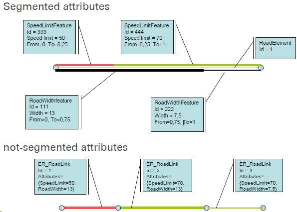

# Transport Telematics

===
Source: Dr.-Ing. Martin Metzner, Transport Telematics  
<https://www.iigs.uni-stuttgart.de/lehre/geoengine/transport_telematics-ws/>  
Outline: Zhouyan Qiu, msqiuzy@outlook.com

## introduction

### motivation

* telematics is transportation and processing of information and advanced telecommunication services - long distance data exchange
* transport telematics is acquisition, processing and transmission of transport relevant data and information
* application: traffic guidance systems, driver assistance systems
* why transport telematics: ensure mobility
  * enhancement of safety
  * increase of efficency
  * reduction of adverse impacts on environment

### obstacles for transpot telematics

* supply of necessary data with sufficient quality
* organizational and legal barriers/vagueness
* refinancing of development costs of telematic systems
* cost-covering operation of telematic services
* missing harmonisation and standardisation
adverse impacts due to incresing complexity and cross-linking of the components

### intelligent transport systems(ITS)

add information and communication technologies to transport infrastructure and vehicles

### Functional architecture of a navigation system

### data & information

data: a formalized collection of facts, concepts, and instructions, usable for communication or processing by humans or automated methods  

information: purpose-oriented knowledge necessary for acting to reach the intended aims  
information results from the application of rules and instructions on data

## digital maps

### classification of maps and geodata

* format: raster data, vector data
* type: cadastral map, city map, aerial photos/satellite images
* coordinate system/map projection: Gauß-Krüger/WGS84/UTM
* content: features, attributes
* source: public, commercial

### GDF

#### data structure

  

* objects/features
  * road elements/roads
  * junctions/intersections
* attributes
  * street name
  * direction of the traffic flow(DF)
* relation
  * turn restrictions

#### division into three levels

  

* geometry - level 0
  * basic geometry/topological primitives, nodes, edges and faces
  * coordinates define spatial arrangement
* simple features - level 1
  * points, lines and areas
  * every feature represents one object given in reality
* complex features level 2
  * put together using simple features
  * description of the road network from the view of the driver

#### acquisition of road geometry

  

* road element consists of edges
* edges represents the centreline of the carriageway
* separated carriageways - two road elements are captured
* edges have to be completely inside the carriageway

#### modelling of traffic flow - directed graph, direction by digitization

#### attribute model

* each feature can carry any number of attributes
* attribute belongs to a feature, has exactly one type and one value(but can be complex)
* concepts: complex, segmented, time-dependent

#### segmented attributes - different parts of the object

  

* absolute segmentation: related to the length in the geometrical representation(from a defind start point)
* relative segmentation: related to measured length by a percentage value
* advantage: less notes, less processing time

#### data model for semantic relations

* connection of two (n) objects
* relationship contains attributes, a name and a code such as features
* with relationships turns are modelled
  * prohibited manoeuvre
  * restricted manoeuvre
  * priority manoeuvre

#### topology is a branch of mathematics that is an extension of geometry

  

* 3 levels: geometry(line, node, equal coordinate) - direction of traffic flow - relations
* topology from geometry
  * same nodes from two edges
  * two areas border on the same edge
* topology from thematic
  * road element is specified as one way by attribute DF
  * prohibited manoeuvre by relationship

#### GDF

* Data exchange format: simplified representation of the Media Record specification for line features
* one standard - two maps
  * different interpretation of the rules for acquisition
  * different acquisition tasks
  * usage of different data sources
  * completely independen acquisition
* acquisition
  * secondary data captureing by ortho photos, topographical maps and import of digital data bases
  * adding primary data capturing is necessary
    * attributes of road elements
    * turn restriction
    * signage
  * application of mobile mapping vehicles
    * metrological acquisition of road geometry by an positioning system
    * acquistion of road related attributes and relationships by geo coded video images